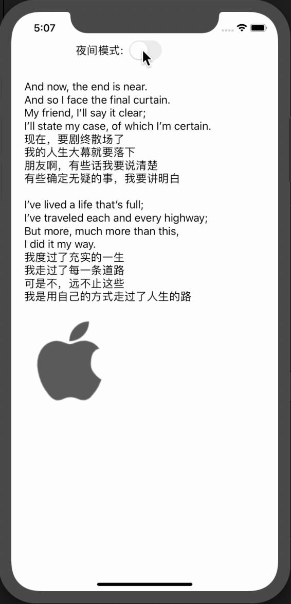

# iOSDarkMode
日间夜间模式demo iOS13




 ## 1.iOS 13下增加了很多动态颜色
 view.backgroundColor = UIColor.systemBackground
 label.textColor = UIColor.label
 placeholderLabel.textColor = UIColor.placeholderText

 擅用这些颜色会节省不少时间。


### 1.1闭包 根据当前的模式来设置颜色。


```swift

        // 闭包 根据当前的模式来设置颜色。
        let backgroudcolor = UIColor { (traitCollection) -> UIColor in
            switch traitCollection.userInterfaceStyle {
            case .light:
                return UIColor.white
            case .dark:
                return UIColor.black
            default:
                fatalError()
            }
        }
        
        view.backgroundColor = backgroudcolor;
        
        let labelColor = UIColor { (traitCollection) -> UIColor in
            switch traitCollection.userInterfaceStyle {
            case .light:
                return UIColor.black
            case .dark:
                return UIColor.white
            default:
                fatalError()
            }
        }
        contentLabel.textColor = labelColor
```


### 1.2获取当前模式

```swift
if self.traitCollection.userInterfaceStyle == .dark {
            // Dark deal like cgcolor
            print("in dark mode")
        } else {
            // Light
            print("in light mode")
        }
```

### 1.3主动设置全局模式

```swift
//实际项目中，如果是iOS应用这么写没问题，但是对于iPadOS应用还需要判断scene的状态是否激活
        let scene = UIApplication.shared.connectedScenes.first?.delegate as? SceneDelegate
        if sender.isOn {
            scene?.window?.overrideUserInterfaceStyle = .dark
        }else{
            scene?.window?.overrideUserInterfaceStyle = .light
        }
```

### 1.4监听日间夜间模式切换

```swift
override func traitCollectionDidChange(_ previousTraitCollection: UITraitCollection?) {
        super.traitCollectionDidChange(previousTraitCollection)
        if traitCollection.hasDifferentColorAppearance(comparedTo: previousTraitCollection) {
            print("mode切换了!!")
        }
    }
```


 ## 2.图片的适配

 打开 Assets.xcassets
 把图片拖拽进去
 右侧工具栏中点击最后一栏，点击 Appearances 选择 Any, Dark
 在给出的框框中拖入日间和夜间模式的icon
 然后正常调用 imageView.image = UIImage(named: "icon")

 ## 3.Xib中的说明
 xib 要做颜色适配只能在 Assets.xcassets 里创建 ColorSet，但是 ColorSet 是 Xcode 9 才出的东西（对标 iOS 11）...所以如果用 xib 布局，又要适配 dark mode，只能把最低版本设置成 iOS 11+


 ## 4. Status Bar
 之前 Status Bar 有两种状态，default 和 lightContent
 现在 Status Bar 有三种状态，default, darkContent 和 lightContent
 现在的 darkContent 对应之前的 default，现在的 default 会根据情况自动选择 darkContent 和 lightContent

 ## 5.UIActivityIndicatorView
 之前的 UIActivityIndicatorView 有三种 style 分别为 whiteLarge, white 和 gray，现在全部废弃。
 增加两种 style 分别为 medium 和 large，指示器颜色用 color 属性修改。